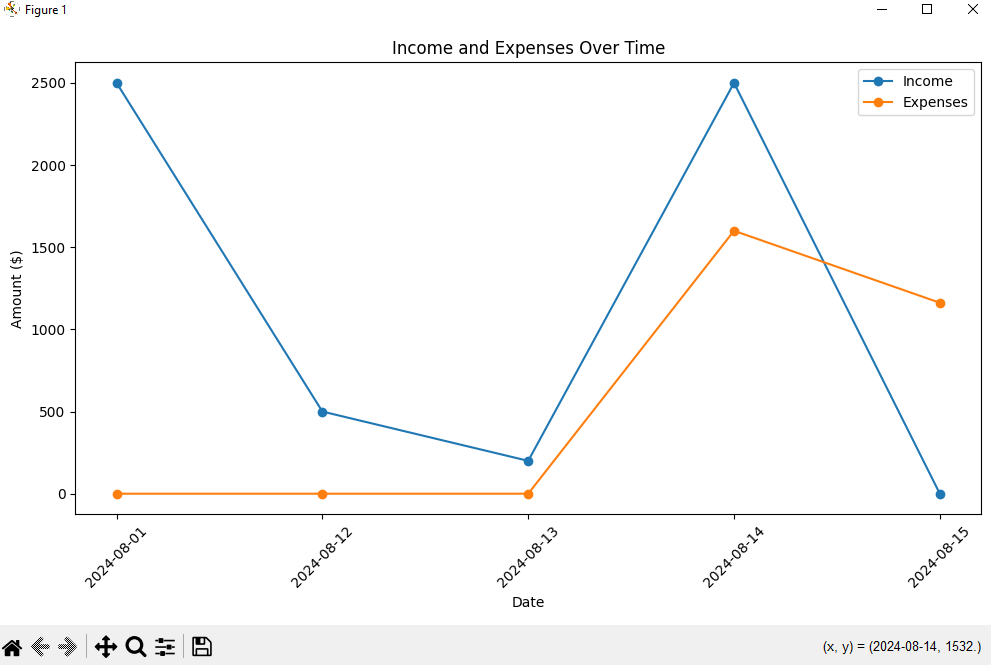

# Finance Manager

## Overview

Finance Manager is a desktop application developed with Python and Tkinter. It allows users to manage their personal finances by adding, viewing, editing, and deleting transactions. The app features a clean, responsive design and includes advanced reporting and visualization tools for tracking income, expenses, and savings over time. 

### Key Features

- **Transaction Management**: Easily add, view, edit, and delete financial transactions.
- **Reports**: Generate monthly and yearly financial summaries.
- **Visualizations**: View income and expenses trends, category spending, and cumulative savings through various charts.
- **Dark Mode**: Switch between light and dark themes for comfortable use in different environments.
- **Responsive Design**: The interface adjusts seamlessly to different window sizes.

## Table of Contents

- [Installation](#installation)
- [Usage](#usage)
- [Features](#features)
- [Screenshots](#screenshots)
- [License](#license)

## Installation

1. **Clone the repository:**

    ```bash
    git clone https://github.com/yourusername/finance-manager.git
    cd finance-manager
    ```

2. **Install dependencies:**

    Make sure you have Python installed (preferably Python 3.8 or higher).

    Install the required Python packages:

    ```bash
    pip install -r requirements.txt
    ```

3. **Run the application:**

    ```bash
    python main.py
    ```

## Usage

1. **Login/Register**: When you first launch the app, you'll be prompted to log in or register. Create a new account if you don't have one.

2. **Add Transactions**: After logging in, you can add new transactions by entering the date, amount, category, and description. Toggle the Income/Expense button to specify the transaction type.

3. **View and Edit Transactions**: The main dashboard allows you to view your transaction history. You can select any transaction to edit or delete it.

4. **Generate Reports**: Use the Reports menu to generate and view monthly and yearly summaries directly within the app.

5. **Visualizations**: Generate different charts to visualize your financial data over time.

6. **Dark Mode**: Switch between light and dark themes using the View menu.

## Features

### Transaction Management

- **Add Transaction**: Record your daily transactions with ease.
- **View Financial Summary**: Access a summary of your income, expenses, and net savings directly on the dashboard.
- **Edit/Delete Transactions**: Modify or remove transactions as needed.

### Reporting

- **Monthly Report**: Get a breakdown of your financial activity by month.
- **Yearly Summary**: View an annual summary of your income, expenses, and savings.
- **Custom Reports**: Generate reports for custom date ranges.

### Visualization

- **Income vs Expenses**: Compare your income and expenses over time.
- **Category Spending**: Analyze spending patterns by category.
- **Cumulative Savings**: Track your savings growth.
- **Histogram and Boxplots**: View the distribution of transaction amounts.

## Screenshots

### Dashboard


### Add Transaction


### Monthly Report


### Income vs Expense Chart



## License

This project is licensed under the MIT License. See the [LICENSE](LICENSE) file for details.

---

